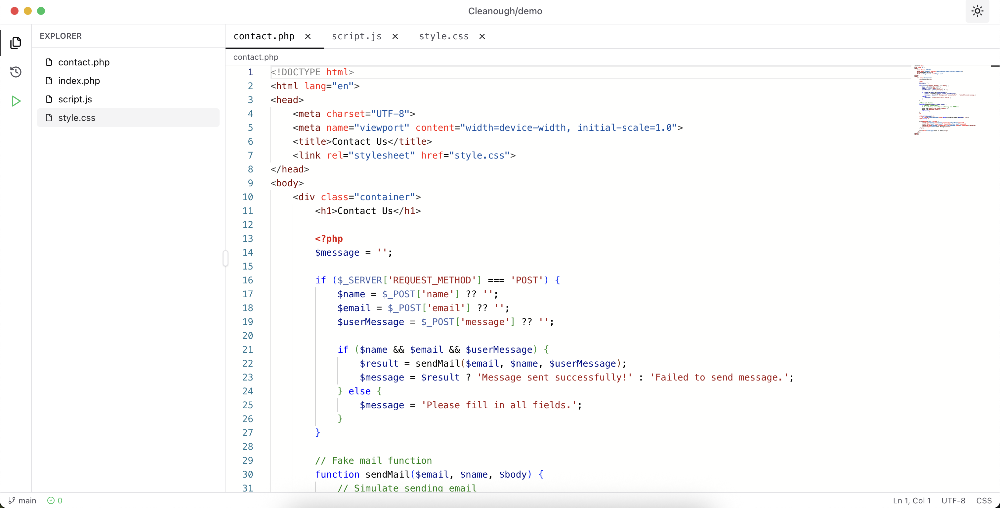

# Cleanough

An open source, git-powered code presentation platform that transforms GitHub repositories into interactive, presentation-ready experiences. Browse, explore, and present code commits in a VS Code-like interface.

<h1 align="center">
   <picture>
   <source media="(prefers-color-scheme: dark)" srcset="public/bg-dark.png">
   
   </picture>
</h1>

## Features

### Explorer Mode
- Browse repository files with a familiar VS Code-style interface
- Syntax highlighting for 50+ programming languages via Monaco Editor
- Media preview support (images, audio, video)
- Tabbed interface for managing multiple open files
- Breadcrumb navigation and file tree explorer

### History Mode
- Step through commits like presentation slides
- View detailed commit information and file diffs
- Navigate between changes with precision controls
- Infinite scrolling pagination through commit history

### Output Mode
- Showcase execution results alongside code
- Display terminal outputs and rendered images
- Metadata-driven output organization via `__cleanough/meta.json`

## Getting Started

To view any GitHub repository as a presentation, simply visit:

```
https://cleanough.netlify.app/repos/[owner]/[repo]
```

Replace `[owner]` with the GitHub username or organization, and `[repo]` with the repository name.

**Example:** `https://cleanough.netlify.app/repos/facebook/react`

## Repository Metadata

Repositories can include an optional `__cleanough/meta.json` file to customize the presentation experience.

### Configuration

Create a `__cleanough/meta.json` file in your repository root:

```json
{
  "order": [
    {
      "type": "file",
      "path": "contact.php"
    },
    {
      "type": "file",
      "path": "style.css"
    },
    {
      "type": "image",
      "path": "__cleanough/outputs/browser-1.png"
    },
    {
      "type": "image",
      "path": "__cleanough/outputs/browser-2.png"
    },
    {
      "type": "terminal",
      "path": "__cleanough/outputs/terminal-1.txt"
    },
    {
      "type": "image",
      "path": "__cleanough/outputs/browser-3.png"
    }
  ],
  "outputs": [
    {
      "type": "image",
      "path": "__cleanough/outputs/browser-1.png"
    },
    {
      "type": "image",
      "path": "__cleanough/outputs/browser-2.png"
    },
    {
      "type": "terminal",
      "path": "__cleanough/outputs/terminal-1.txt"
    },
    {
      "type": "image",
      "path": "__cleanough/outputs/browser-3.png"
    }
  ]
}
```

### Fields

- **order**: Defines the sequence of items to display in the presentation. Each item has:
  - `type`: Either `"file"`, `"image"`, or `"terminal"`
  - `path`: Path to the file relative to repository root

- **outputs**: Specifies output assets (screenshots, terminal logs) to display alongside code. Store these in `__cleanough/outputs/` directory.

### Supported Output Types

| Type | Description |
|------|-------------|
| `file` | Source code files to display |
| `image` | Screenshots or diagrams (PNG, JPG, GIF, etc.) |
| `terminal` | Terminal/console output text files |

## Use Cases

- **Tutorials**: Create step-by-step code walkthroughs with visual outputs
- **Portfolio**: Present projects to potential employers
- **Education**: Teach programming concepts with commit-by-commit progression
- **Conferences**: Interactive code samples for talks and presentations
- **Code Reviews**: Visualize code evolution and refactoring

## License

MIT
